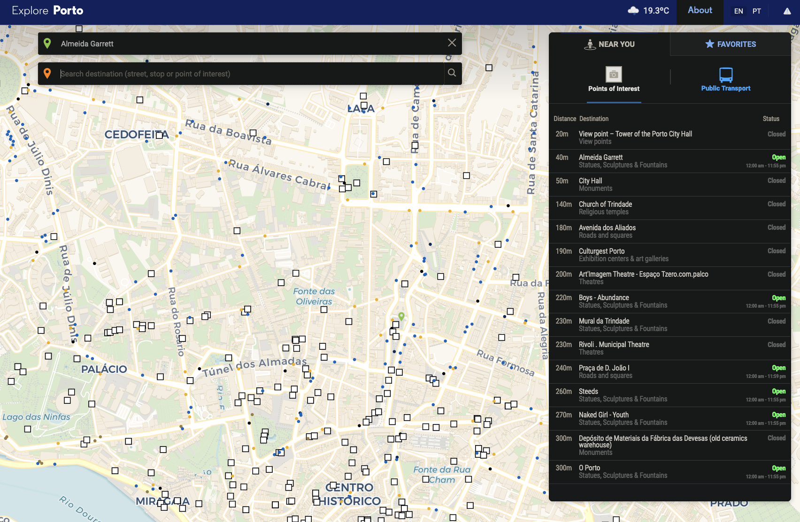
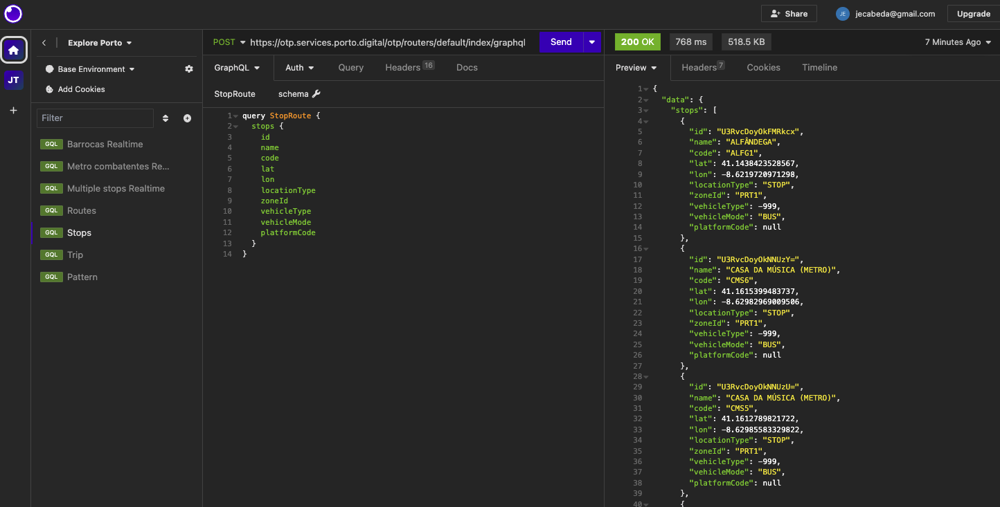

# How Porto moves: a duckdb saga

José Cabeda

---

# Pre

1. The guy
2. The problem
3. The api
4. The solution
5. The demo
6. The future

---

# The guy

- José Cabeda
- Data Engineer
- Fidel API
- Porto, Portugal
- Random thoughts on [cabeda.dev](cabeda.dev)

---

# The problem

- Porto is the second biggest city Portugal
- Lot's of issues with the public transportation
  - Missing buses
  - Lot's of delays (some due to traffic)

---

# Can we see this=

- In recent years we've got a new platform explore porto explore.porto.pt/
- Supports
  - buses and metro
  - realtime and schedule trips

---

# The API

Behind the scenes there's a graphql API

---

# How can we solve this?

---

Future roadmap

- Currently on version 0.0.1
- Realtime map with metrics
- Automate data pipeline on AWS for historical
  - Lambda
  - S3
  - Update duckdb automatically

---

# Thank you!
